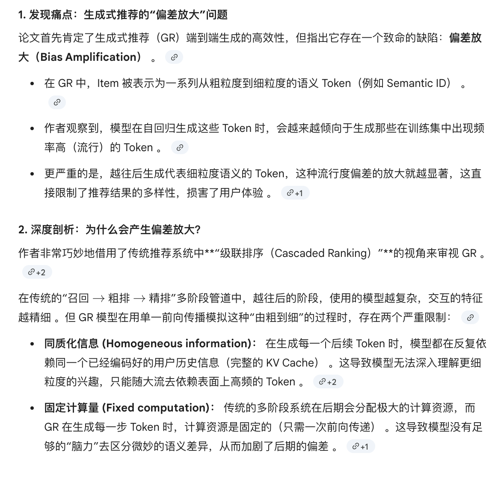
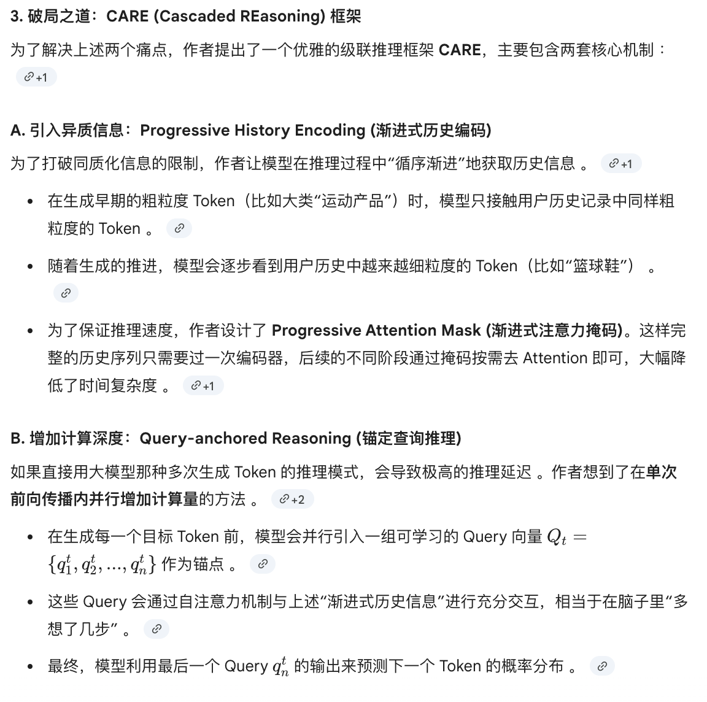
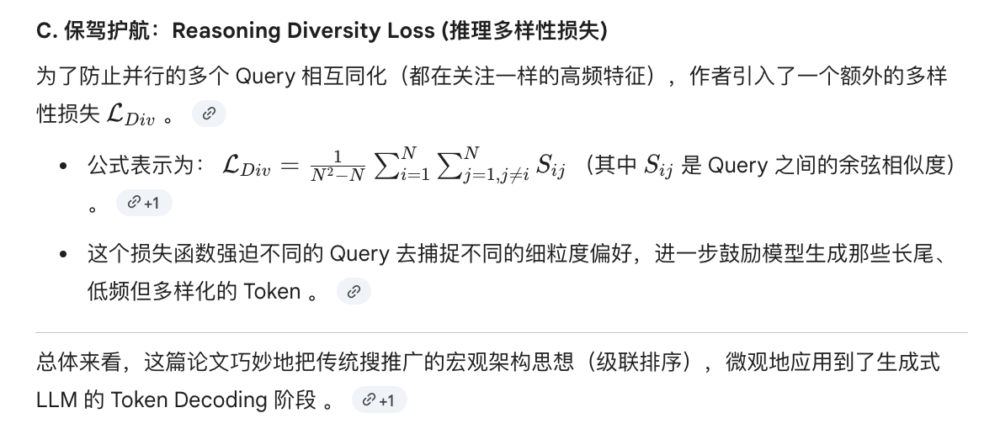

# CARE

这篇论文关注生成式推荐里的“偏置放大”问题：模型在逐 token 生成语义 ID 时，会越来越偏向高频、热门 token，导致推荐多样性下降。作者把生成式推荐重新理解成一种级联排序过程，认为问题主要来自两点：一是对用户历史的编码过于同质化，二是每一步生成都只用固定计算量，难以在后期做更细粒度的偏好判断。

论文提出 **CARE** 框架，核心做法有两部分。第一是 **渐进式历史编码**，随着生成过程推进，逐步引入更细粒度、更多样的历史信息，而不是所有阶段都看同一份压缩表示。第二是 **query-anchored reasoning**，在每个生成阶段围绕当前查询做并行推理，用额外推理步骤深化对历史行为的理解。整体上，CARE就是把“更多异质信息 + 更多阶段化推理”注入生成式推荐，从而缓解热门偏置的逐步累积。






核心问题：  
**生成式推荐在逐 token 生成 item semantic ID 时，会不断放大热门 token 的偏置，导致推荐多样性下降。**

---

## 1. 背景：Generative Recommendation 做什么？

生成式推荐把每个 item 表示成一个 semantic ID：

```text
item = <c1, c2, c3, c4>
````

这些 token 通常具有从粗到细的语义：

```text
c1：粗粒度类别
c2：更细类别
c3：更细语义
c4：接近具体 item
```

模型根据用户历史自回归生成下一个 item：

```text
用户历史 X → 生成 c1 → 生成 c2 → 生成 c3 → 生成 c4
```

普通 GR 公式：

```text
h = KV(X)

c_t = argmax_c M(c | h, c_<t)
```

含义：

```text
先把用户历史 X 编码成 h，
然后每一步都基于同一个 h 生成下一个 semantic token。
```

---

## 2. 核心问题：Bias Amplification

作者发现：
GR 生成 semantic ID 时，会放大热门 token 的概率。

更具体地说：

```text
测试集中热门 token 本来就多；
模型生成时会让热门 token 更热门；
而且越往后生成，这种偏置越严重。
```

后果：

```text
token-level popularity bias
        ↓
item-level popularity bias
        ↓
推荐结果集中在热门 item
        ↓
多样性下降，echo chamber 加剧
```

---

## 3. 为什么会出现这个问题？

作者从 **cascaded ranking** 视角分析 GR。

传统推荐系统通常是：

```text
Retrieval → Pre-rank → Rank
```

特点是：

```text
越往后，候选越少；
越往后，模型越复杂；
越往后，需要更细粒度用户偏好。
```

GR 虽然是 end-to-end，但也类似 cascaded ranking：

```text
生成 c1：粗粒度筛选 item
生成 c2：进一步筛选共享 <c1,c2> 前缀的 item
生成 c3/c4：更细粒度筛选
```

所以 GR 的每个 token 生成阶段，本质上对应推荐系统的一个排序阶段。

---

## 4. 普通 GR 的两个缺陷

### 4.1 Homogeneous Information

普通 GR 每一步都使用同一个历史表示 `h`：

```text
生成 c1：用 h
生成 c2：用 h
生成 c3：用 h
生成 c4：用 h
```

但不同阶段需要不同粒度信息：

```text
生成 c1：只需要粗粒度兴趣
生成 c4：需要细粒度偏好
```

如果每一步都看同一份历史表示，模型容易依赖热门 token 这种表层统计模式。

---

### 4.2 Fixed Computation

普通 GR 每个 token 阶段的计算量基本固定：

```text
生成 c1：一次 forward
生成 c2：一次 forward
生成 c3：一次 forward
生成 c4：一次 forward
```

但越往后的 token 越细，需要更深的用户偏好理解。
计算量不够时，模型更容易退化成选择热门 token。

---

# 5. 方法：CARE

CARE 的目标是解决两个问题：

```text
1. 不同阶段应该看不同粒度的历史信息
2. 不同阶段应该有更强的推理能力
```

对应两个核心模块：

```text
Progressive History Encoding
Query-anchored Reasoning
```

再加两个辅助设计：

```text
Progressive Attention Mask
Reasoning Diversity Loss
```

---

## 6. Query-anchored Reasoning

### 6.1 目的

解决 **Fixed Computation** 问题。

普通 GR 是直接生成：

```text
history + prefix tokens → c_t
```

CARE 在每个 stage 插入 learnable query vectors：

```text
Q_t = (q_t^1, q_t^2, ..., q_t^n)
```

这些 query 是可学习向量，用作 reasoning anchors。

CARE 公式：

```text
p = M(h, Q1, c1, ..., Q_{t-1}, c_{t-1}, Q_t)

c_t = argmax_c p[c]
```

---

### 6.2 query anchor 是什么？

从 Transformer 计算角度看，它像普通 token：

```text
有 hidden state
参与 self-attention
可以 attend 历史 token
也可以被后续 token/query attend
```

但语义上它不是普通 token：

```text
semantic token：离散 token，是 item ID 的一部分
query anchor：连续可学习向量，不属于 item ID，不作为输出
```

所以：

```text
query anchor 在计算中像 token；
但在语义和训练目标上不是 token。
```

---

### 6.3 query 如何学到不同偏好？

不是严格保证，而是通过训练诱导。

主要靠：

```text
1. query 本身是可学习参数
2. 推荐损失 L_rec 让 query 学到有助于预测 token 的信息
3. diversity loss 约束不同 query 不要太相似
```

因此不同 query 可能学到不同偏好锚点，例如类别、品牌、近期兴趣、长尾兴趣等。

---

### 6.4 为什么用最后一个 query 预测？

假设：

```text
Q_t = [q_t^1, q_t^2, q_t^3]
```

在 causal self-attention 下：

```text
q_t^1 可以看历史
q_t^2 可以看历史 + q_t^1
q_t^3 可以看历史 + q_t^1 + q_t^2
```

所以最后一个 query 可以聚合前面 query 的推理信息。

因此用最后一个 query 的 hidden state 预测当前 token。

---

## 7. Progressive History Encoding

### 7.1 目的

解决 **Homogeneous Information** 问题。

不同 stage 应该看不同粒度的历史。

假设历史 item 是：

```text
history item = <a, b, c, d>
```

CARE 让不同阶段看到不同信息：

```text
Stage 1：只看 <a>
Stage 2：看 <a, b>
Stage 3：看 <a, b, c>
Stage 4：看 <a, b, c, d>
```

直觉：

```text
早期 token：粗粒度兴趣即可
后期 token：需要细粒度偏好
```

可以表示为：

```text
h_t = KV(X̃_t)
```

其中：

```text
X̃_t：第 t 阶段选择的部分历史信息
h_t：第 t 阶段使用的历史表示
```

---

## 8. Progressive Attention Mask

如果每个 stage 都重新编码历史，会重复计算很多 KV，开销大。

直接做 progressive encoding：

```text
Stage 1 编码 M 个 token
Stage 2 编码 2M 个 token
Stage 3 编码 3M 个 token
...
```

复杂度：

```text
O(l^3 M^2 d)
```

CARE 的做法：

```text
完整历史只编码一次；
用 attention mask 控制不同 stage 的 query 能看哪些历史 token。
```

复杂度变为：

```text
O(l^2 M^2 d)
```

核心：

```text
不是反复编码历史，
而是一次编码，通过 mask 控制可见范围。
```

---

## 9. 图 5 怎么理解？

图 5 是 progressive attention mask。

读法：

```text
行：当前 token/query
列：它能看到的信息
√：允许 attend
空白：被 mask 掉
```

每个 stage 有两行：

```text
第一行：红色 query anchor 行
第二行：当前 stage 的 semantic token 行
```

例如：

```text
Stage 1：
第一行 Q1，用来推理并预测 c1
第二行 c1，表示生成出来的第 1 个 semantic token

Stage 2：
第一行 Q2，用来推理并预测 c2
第二行 c2，表示生成出来的第 2 个 semantic token
```

关键点：

```text
progressive mask 主要限制红色 query 行。
```

例如历史 item 是：

```text
<蓝, 绿, 黄>
```

则：

```text
Stage 1 的 query：只能看蓝色历史 token
Stage 2 的 query：能看蓝色 + 绿色历史 token
Stage 3 的 query：能看蓝色 + 绿色 + 黄色历史 token
```

而每个 stage 的第二行是普通 semantic token，遵循 causal attention，所以它可以看到前面的历史 token。

---

## 10. Reasoning Diversity Loss

多个 query 可能学到相同信息，所以作者加入 diversity loss。

公式：

```text
L_div = 1 / (N^2 - N) * Σ_i Σ_{j≠i} S_ij
```

其中：

```text
S_ij：第 i 个 query 和第 j 个 query 的 cosine similarity
N：query 总数
```

如果两个 query 太相似，loss 变大。

总损失：

```text
L = L_rec + α L_div
```

含义：

```text
L_rec：保证推荐准确
L_div：鼓励 query 学到不同信息
```

---

## 11. 训练和推理

### 训练

训练时知道目标 item：

```text
target item = <c1, c2, c3, c4>
```

使用 teacher forcing：

```text
Stage 1：history + Q1 → 预测 c1
Stage 2：history + Q1 + c1 + Q2 → 预测 c2
Stage 3：history + Q1 + c1 + Q2 + c2 + Q3 → 预测 c3
Stage 4：history + prefix + Q4 → 预测 c4
```

query anchor 会通过 `L_rec` 和 `L_div` 被更新。

---

### 推理

推理时没有真实 token，需要自回归生成：

```text
Step 1：history + Q1 → 生成 c1
Step 2：history + generated c1 + Q2 → 生成 c2
Step 3：history + generated c1,c2 + Q3 → 生成 c3
Step 4：history + generated prefix + Q4 → 生成 c4
```

最终：

```text
<c1, c2, c3, c4> → 映射回真实 item
```

query anchor 只参与内部推理，不作为结果输出。

---

## 12. 实验结论

### 12.1 准确率提升

CARE 加到 TIGER、LETTER、SETRec 等 GR backbone 上，Recall/NDCG 大多提升。

自回归 GR 上提升更明显，因为 CARE 的 progressive reasoning 适合 coarse-to-fine token generation。

---

### 12.2 多样性提升

CARE 提高 DivR，降低 ORR。

说明：

```text
推荐结果中 unique items 更多；
热门 item 被过度推荐的比例下降。
```

也就是 CARE 不仅提高准确率，也缓解 popularity bias。

---

### 12.3 后期 token 提升更明显

CARE 对后几个 token 的提升最大。

原因：

```text
前期 token：粗粒度，较容易预测
后期 token：细粒度，需要更深推理
```

这正好验证了 CARE 的动机。

---

### 12.4 开销较小

CARE 的 query reasoning 是并行插入一次 forward 中的，不是额外生成自然语言 reasoning tokens。

因此推理时间和显存开销增加较小。

---

## 13. 方法局限

```text
1. query anchor 不一定具备明确可解释性
   不能保证 q1=品牌、q2=类别、q3=价格

2. 对 parallel GR 的提升较小
   因为 parallel GR token 不一定严格 coarse-to-fine

3. 依赖 semantic ID 的质量
   如果 semantic ID 没有良好的层次语义，CARE 效果可能下降

4. 第一个 token 仍然较难
   可能受到用户兴趣漂移影响
```

---

# 14. 最终总结

这篇论文的核心逻辑：

```text
问题：
生成式推荐逐 token 生成 semantic ID 时，会放大热门 token 偏置。

原因：
普通 GR 每个阶段都看同一份历史表示；
每个阶段计算量固定。

方法：
CARE 引入 progressive history encoding，
让不同阶段看不同粒度历史；
引入 query-anchored reasoning，
让每个阶段有额外推理能力；
用 progressive attention mask 保持效率；
用 diversity loss 避免 query 学成一样。

结果：
CARE 提升推荐准确率和多样性，
降低热门 item 过度推荐，
且额外推理开销较小。
```

一句话概括：

```text
CARE 的本质是：
把传统多阶段推荐中“越往后越精细、越往后计算越多”的思想，
迁移到生成式推荐的 semantic token 生成过程中。
```

```
```
