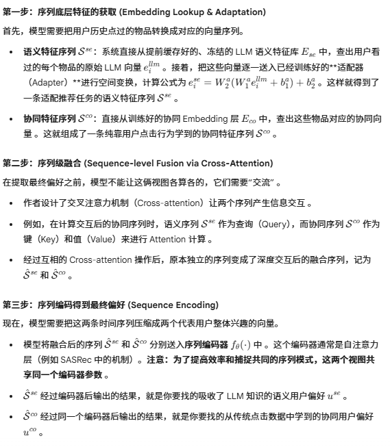

# 论文阅读笔记：LLM-ESR (NeurIPS 2024)

**论文题目**：LLM-ESR: Large Language Models Enhancement for Long-tailed Sequential Recommendation

**研究方向**：序列推荐系统（SRS）、大语言模型（LLMs）、长尾推荐

**发表记录**：NeurIPS 2024

长尾用户和item的表征学习，利用大模型提取语义，如何和协调信息concat

---

## 1. 研究动机 (Motivation)

在现实的推荐系统中（如电商、短视频），数据呈现极度的“长尾分布”。这导致传统的序列推荐系统（SRS）面临两大挑战：
1. **长尾物品（Long-tail Item）挑战**：大部分物品很少被点击或购买。由于传统 SRS 极度依赖“协同过滤信号”（即用户的历史点击数据），遇到没人点过的物品时，就无法学习到准确的特征表示。
2. **长尾用户（Long-tail User）挑战**：绝大多数用户的历史交互记录非常少（比如只买过1-2件商品），模型很难仅仅依靠这零星的记录刻画出准确的用户偏好画像。

**引入大语言模型（LLM）的契机与痛点**：
LLM 拥有丰富的外部先验知识和强大的语义理解能力，理论上可以通过分析物品描述或用户历史，直接弥补协同数据的缺失。但是：
* **推理成本极高**：如果在线推荐时每次都调用 LLM，延迟和算力成本在工业界是不可接受的。
* **语义信息丢失**：现有的一些基于 Embedding 的方法，往往直接把 LLM 提取的向量作为初始化，随后在训练中放开更新，这会破坏原始的语义关系；且大多只关注物品端，忽略了对长尾用户的增强。

基于此，作者提出了 **LLM-ESR** 框架，旨在无缝利用 LLM 的语义知识来增强推荐系统，同时做到**零额外的在线推理开销**。

---

## 2. 核心方法 (Methodology)

LLM-ESR 框架包含两个核心模块，分别用来攻克长尾物品和长尾用户问题。在处理前，模型会离线使用 LLM（如 OpenAI API）将物品的属性文本和用户的历史交互文本转化为高维的 **语义向量（Semantic Embeddings）** 并缓存下来。

### 模块一：双视图建模 (Dual-view Modeling) —— 解决“长尾物品”问题
为了让推荐模型既能利用传统的协同信号，又能利用 LLM 的语义信号，作者设计了一个双分支网络：
1. **语义视图 (Semantic-view)**：
   * 输入 LLM 提取的物品语义向量。为了防止灾难性遗忘和语义关系被破坏，**这部分 LLM 向量在训练中是冻结（Frozen）的**。
   * 通过引入一个可训练的适配器（Adapter），将高维的语义向量降维并映射到推荐系统的特征空间中。
2. **协同视图 (Collaborative-view)**：
   * 采用传统推荐系统的做法，维护一个可训练的 Item Embedding 表。
   * 为了解决两个视图训练进度不一致的问题，作者巧妙地用 PCA 降维后的 LLM 语义向量去**初始化**这个协同特征表。
3. **双层融合 (Two-level Fusion)**：
   * **序列级融合**：设计了一个交叉注意力机制（Cross-attention），让协同特征序列和语义特征序列进行信息交互。
   * **Logit级融合**：在最后预测用户下一步点击时，将两个视图得到的最终用户表示直接拼接（Concat），计算推荐得分。

### 模块二：检索增强的自蒸馏 (Retrieval Augmented Self-Distillation) —— 解决“长尾用户”问题
长尾用户自身数据太少，因此需要向“相似的邻居”借用知识：
1. **检索相似用户**：
   * 将缓存的“LLM 用户语义向量”作为检索库。通过计算余弦相似度，为每一个长尾用户检索出 Top-N 个在语义上最相似的其他用户。
2. **自蒸馏学习 (Self-Distillation)**：
   * 那些被检索出来的相似邻居，往往包含了更多、更丰富的交互记录。
   * 模型将这 N 个邻居经过双视图网络后得到的用户表示**求平均**，作为知识蒸馏中的“老师（Teacher）”。
   * 用这个 Teacher 的特征去指导和约束当前目标长尾用户（“学生”，Student）的特征学习。
   * 这个过程引入了一个额外的蒸馏损失函数（$\mathcal{L}_{SD}$），与推荐任务的排序损失共同优化模型。

---

## 3. 训练与推理机制 (Train and Inference)

* **训练阶段 (Train)**：同时优化成对排序损失（Pairwise Ranking Loss）和自蒸馏损失。此时 LLM 的原始 Embedding 层保持冻结，仅更新 Adapter、Cross-attention、Sequence Encoder 以及协同 Embedding 层。
* **推理阶段 (Inference)**：极其高效。由于自蒸馏模块仅在训练时提供辅助损失，推理时直接被丢弃。模型只需要通过双视图网络即可输出推荐结果，且所有的 LLM 语义向量都已经提前查表缓存完毕，**完全不需要在线调用 LLM**。

---

## 4. 总结与评价

* **创新性**：将 LLM 与传统序列推荐模型（如 SASRec, BERT4Rec）进行了解耦结合。左手用“双视图”引入物品的语义常识，右手用“相似用户蒸馏”扩充了用户画像。
* **工程实用性极强**：该框架是模型无关的（Model-agnostic），可以作为插件应用到任何现有的推荐算法上；彻底剥离了 LLM 在线推理的延迟负担，具有极高的工业落地价值。

## 自蒸馏模块具体是怎么运作的

长尾用户（点过极少商品的用户）就像是刚开始学习的学生，由于自身交互记录太少，模型很难仅依靠这些零星的数据捕捉到他们真正的偏好 。自蒸馏的目的，就是帮这个差生找几个“学霸邻居”，把学霸的经验传授给他 。具体分为以下三步：

1. 建立语义库并寻找“学霸”（Retrieve Similar Users）
首先，作者把所有用户历史点击过的物品标题拼接起来，让大语言模型（LLM）去阅读，生成每个用户的“LLM用户语义向量”（以此构建了一个语义用户库 $U_{llm}$）。

对于目标长尾用户，模型在这个语义库中计算余弦相似度，检索出 Top-N 个在语义上最相似的用户作为“学霸邻居” 。即使这些邻居交互过的具体商品不同，只要语义上属于同一类兴趣，大模型也能发现他们的相似性。

2. 提取老师的经验（Construct Teacher Mediator）
这些被检索出的相似用户往往包含了更多的交互记录，因此他们的特征表示（经过前面双视图模型编码出来的 $u^{se}$ 和 $u^{co}$）包含了更全面的用户知识 。
模型把这 N 个相似邻居的用户特征进行平均池化（Mean Pooling），融合出一个综合的特征向量，这就是知识蒸馏里的“老师（Teacher）” 。

3. 知识传递与损失计算（Self-Distillation Loss）
当前目标长尾用户自己的特征表示就是“学生（Student）” 。
模型通过计算“老师”和“学生”特征向量之间的均方误差（L2 距离），得出自蒸馏损失函数（$\mathcal{L}_{SD}$）。

关键点：在反向传播计算梯度时，老师特征的梯度是被截断的（stop-gradient），也就是说，模型只是单向地强迫长尾学生的特征去“模仿”和靠近学霸老师的特征，从而学到更丰富的偏好表达 。这部分损失会作为辅助损失（Auxiliary Loss）加入到总的训练目标中 

## 推理阶段如何得到用户的语义偏好和协同偏好
在推理时，用户的历史物品先分别查表得到“语义”和“协同”两条特征序列，接着过一遍 Cross-attention 让双方交换情报，最后送入同一个序列编码器提取出特征，出来的就是 $u^{se}$ 和 $u^{co}$。

